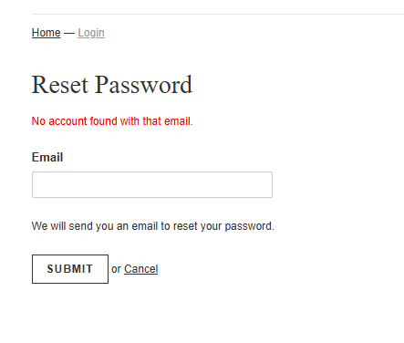
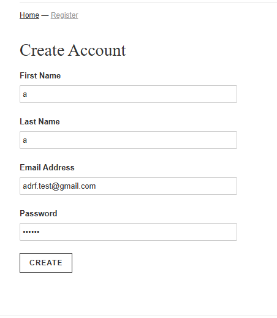
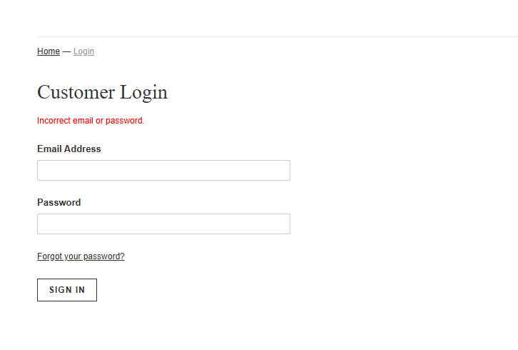

# BUG – WEB-RESETPW-002

## Title
User enumeration vulnerability in password reset

## Description
The system returns a specific message when an email is not registered:

"No account found with that email"

## Steps to Reproduce

1. Go to "Forgot Password"
2. Leave field empty or use unregistered email
3. Submit form

## Expected Behavior
The system should return a generic message such as:

"If the email is registered, you will receive a reset link"

## Actual Behavior
The system explicitly indicates that the account does not exist

## Impact
This allows attackers to verify whether an email is registered in the system (user enumeration)

## Severity
MEDIUM

## Priority
MEDIUM

## Evidence

### System reveals account existence:

### Weak Validation:

### UX Issue:

